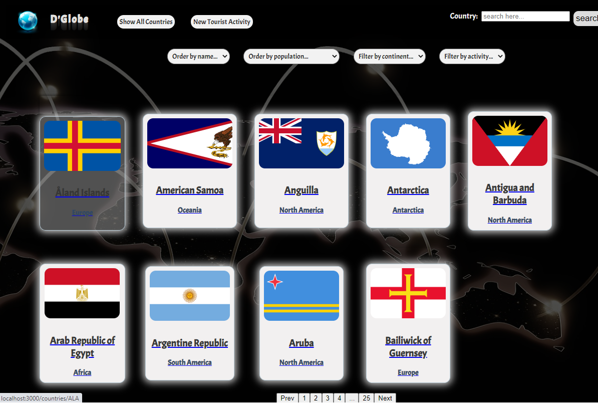
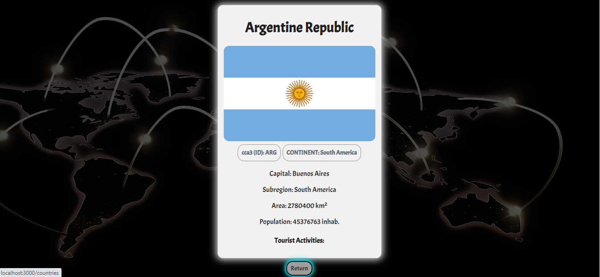
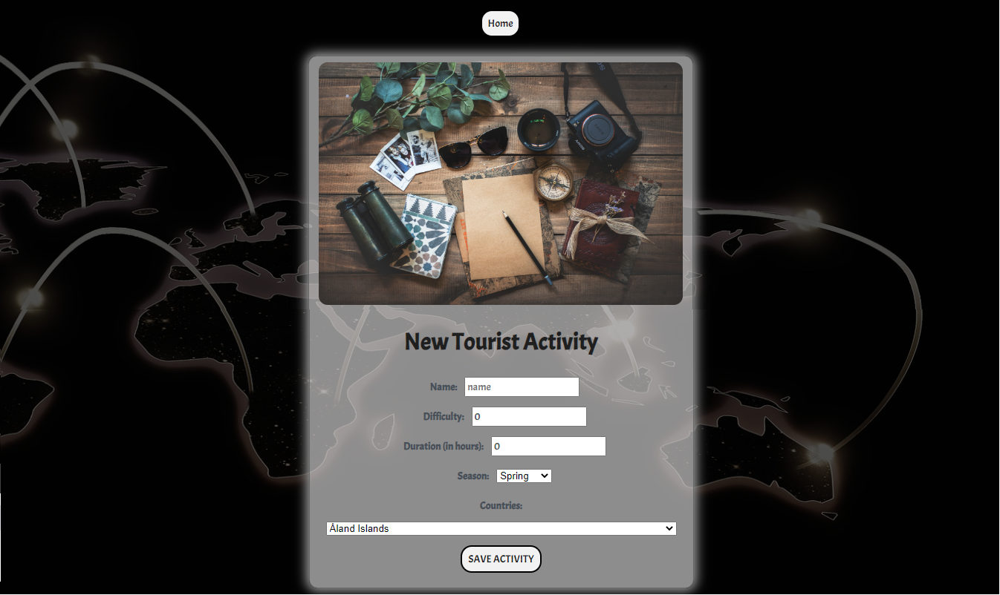

<p align='left'>
    
</p>

# Individual Project - Henry Countries

<p align="left">
  
</p>

## Objetivos del Proyecto

- Construir una App utlizando React, Redux, Node y Sequelize.
- Afirmar y conectar los conceptos aprendidos en la carrera.
- Aprender mejores prácticas.
- Aprender y practicar el workflow de GIT.
- Usar y practicar testing.

__IMPORTANTE:__ Es necesario contar minimamente con la última versión estable de Node y NPM. Asegurarse de contar con ella para poder instalar correctamente las dependecias necesarias para correr el proyecto.

Actualmente las versiónes necesarias son:

 * __Node__: 12.18.3 o mayor
 * __NPM__: 6.14.16 o mayor


## BoilerPlate

El boilerplate cuenta con dos carpetas: `api` y `client`. En estas carpetas estará el código del back-end y el front-end respectivamente.

En `api` crear un archivo llamado: `.env` que tenga la siguiente forma:

```
DB_USER=usuariodepostgres
DB_PASSWORD=passwordDePostgres
DB_HOST=localhost
```

Reemplazar `usuariodepostgres` y `passwordDePostgres` con tus propias credenciales para conectarte a postgres.

Adicionalmente será necesario que creen desde psql una base de datos llamada `countries`


## Descripción

Aplicación que muestra información de  distintos paises utilizando la api externa [restcountries] y a partir de ella poder:

  - Buscar paises
  - Filtrarlos / Ordenarlos
  - Crear actividades turísticas

__IMPORTANTE__: Para las funcionalidades de filtrado y ordenamiento NO se utilizaron los endpoints de la API externa que ya devuelven los resultados filtrados u ordenados sino que fueron realizados por la desarrolladora desde el frontend.

### Únicos Endpoints/Flags utilizados:

  - GET https://restcountries.com/v3/all

### Detalles:

__IMPORTANTE__: No se utilizaron librerías externas para aplicar estilos a la aplicación. Se realizó mediante CSS Modules.

#### Tecnologías necesarias:
- [ ] React
- [ ] Redux
- [ ] Express
- [ ] Sequelize - Postgres

#### Frontend

Aplicación de React/Redux que contiene las siguientes pantallas/rutas.

__Pagina inicial__: landing page


__Ruta principal__: contiene
- [ ] Input de búsqueda para encontrar países por nombre
- [ ] Área donde se ve el listado de países
- [ ] Botones/Opciones para filtrar por continente y por tipo de actividad turística
- [ ] Botones/Opciones para ordenar tanto ascendentemente como descendentemente los países por orden alfabético y por cantidad de población
- [ ] Paginado para ir buscando y mostrando los siguientes paises, 10 paises por pagina, mostrando los primeros 9 en la primer pagina.


__Ruta de detalle de país__: contiene
- [ ] Los campos mostrados en la ruta principal para cada país (imagen de la bandera, nombre, código de país de 3 letras y continente)
- [ ] Código de país de 3 letras (id)
- [ ] Capital
- [ ] Subregión
- [ ] Área (Mostrarla en km2 o millones de km2)
- [ ] Población
- [ ] Actividades turísticas con toda su información asociada


__Ruta de creación de actividad turística__: contiene
- [ ] Un formulario __controlado con JavaScript__ con los siguientes campos:
  - Nombre
  - Dificultad
  - Duración
  - Temporada
- [ ] Posibilidad de seleccionar/agregar varios países en simultáneo
- [ ] Botón/Opción para crear una nueva actividad turística



#### Base de datos

El modelo de la base de datos tiene las siguientes entidades:

- [ ] País con las siguientes propiedades:
  - ID (Código de 3 letras) *
  - Nombre *
  - Imagen de la bandera *
  - Continente *
  - Capital *
  - Subregión
  - Área
  - Población
- [ ] Actividad Turística con las siguientes propiedades:
  - ID
  - Nombre
  - Dificultad (Entre 1 y 5)
  - Duración
  - Temporada (Verano, Otoño, Invierno o Primavera)

#### Backend

Servidor en Node/Express con las siguientes rutas:

- [ ] __GET /countries__:
  - En una primera instancia trae todos los países desde restcountries y los guarda en la propia base de datos y luego ya se utilizan desde allí
  - Listado de los paises.
- [ ] __GET /countries/{idPais}__:
  - Detalle de un país en particular
  - Trae solo los datos pedidos en la ruta de detalle de país
  - Incluye los datos de las actividades turísticas correspondientes
- [ ] __GET /countries?name="..."__:
  - Obtiene los países que coinciden con el nombre pasado como query parameter (No es un matcheo exacto)
  - Si no existe ningún país muestra un mensaje adecuado
- [ ] __POST /activity__:
  - Recibe los datos recolectados desde el formulario controlado de la ruta de creación de actividad turística por body
  - Crea una actividad turística en la base de datos
